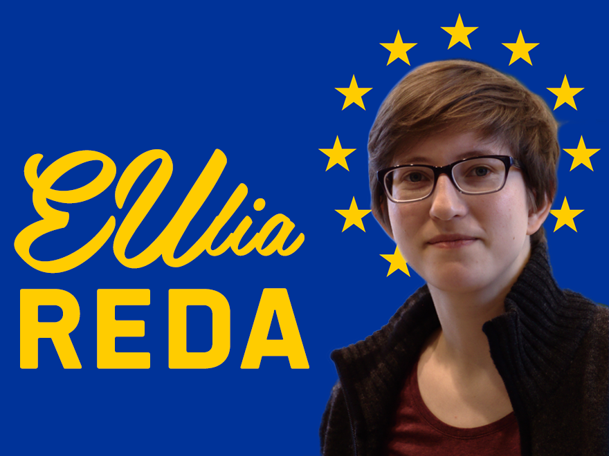

# EUlia Reda

Contributors: c3o, hutt
Tags: translation-ready, microformats, rtl-language-support

Requires at least: 4.0
Tested up to: 4.5.3
Stable tag: 1.0.0
License: GPLv3 or later
License URI: http://www.gnu.org/licenses/gpl-2.0.html

## Description

This Theme was developed by the office of MEP Julia REDA. It's licensed under GPLv3, so feel free to copy, distribute and/or modify.

## Installation

1. In your admin panel, go to Appearance > Themes and click the Add New button.
2. Click Upload and Choose File, then select the theme's .zip file. Click Install Now.
3. Click Activate to use your new theme right away.

## Additional Plugins

* We're using [comment popularity](https://github.com/humanmade/comment-popularity) by [humanmade](https://github.com/humanmade) under the GPL v2 license.
	* Also added a translation in German ([Pull Request](https://github.com/humanmade/comment-popularity/pull/110)).